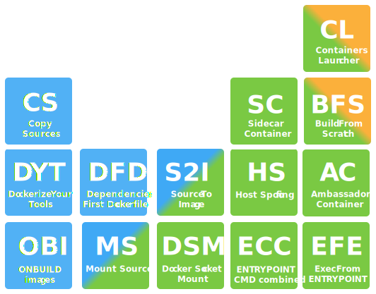
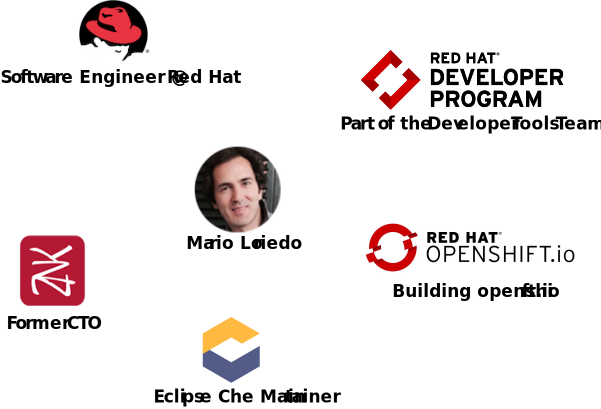
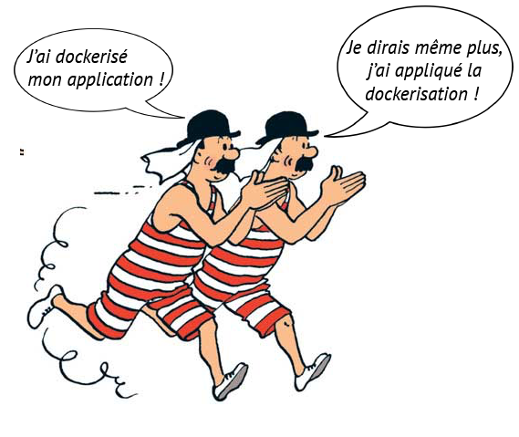
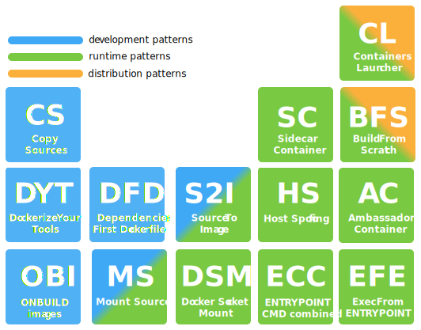
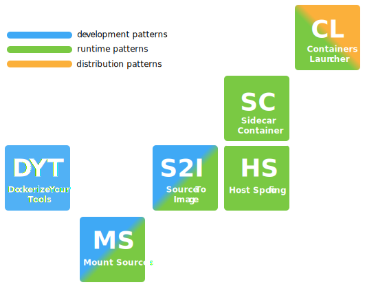
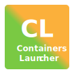
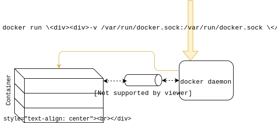
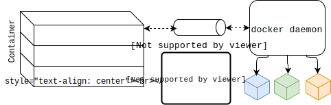
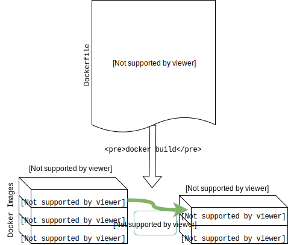
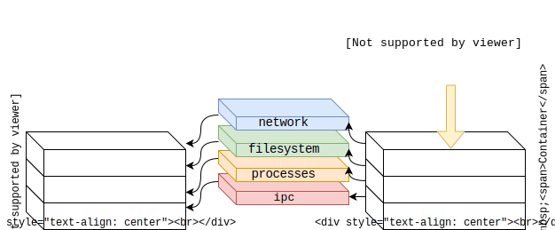

title: Containers Patterns
name: inverse
layout: true
class: center, middle, inverse

<!-- This slide will serve as the base layout for all your slides -->
.bottom-bar[
  .left[@mariolet &emsp; &emsp; &emsp; &emsp; &emsp; &emsp; &emsp; &emsp; &emsp; &emsp; &emsp; &emsp; &emsp; &emsp; &emsp; &emsp; &emsp; &emsp; &emsp; &emsp; &emsp; &emsp; &emsp; &emsp; &emsp; &ensp; github.com/l0rd]
]

---
layout: false
template: inverse
class: center, middle

.tc-center-column[]
# Containers Patterns
#### There are a thousand ways to use containers

.bottom-bar[]
---

layout: false

## Who am I?



---

template: inverse

## Containers usages

---
layout: false

## Everybody use containers

.center[]

---
layout: false

## There are many ways to use containers

.center[]

---

## Containers Patterns Catalog

.tc-left-column[
#### Development Patterns
  - `Copy Sources`
  - `Mount Sources`
  - `Dockerize Your Tools`
  - `ONBUILD Image`
  - `Dependencies First Dockerfile`
  - `Source 2 Image`
]
.tc-center-column[
  #### Distribution Patterns
  - `Build From Scratch`
  - `Containers Launcher`
]
.tc-right-column[
  #### Runtime Patterns
  - `Mount Sources`
  - `Docker Socket Mount`
  - `Containers Launcher`
  - `Build From Scratch`
  - `Host Spoofing`
  - `ENTRYPOINT and CMD combined`
  - `Exec Form ENTRYPOINT`
  - `Source 2 Image`
  - `Sidecar Container`
  - `Ambassador Container`
]

---

template: inverse

## Containers Patterns in Practice

---

layout: false
.center[]

---

layout: false
.center[]

---

template: inverse

.tc-center-column[]

---

.left-column[

## MS
  ### Example
]
.right-column[
## Mount 2048

**Docker Image**<br>2048

**Source code**<br>https://l0rd.github.io/containerspatterns/MS/

**Run command**

```bash
docker run -p 8080:80 \
           -v $(pwd):/usr/local/apache2/htdocs/ \
           httpd
```
]

---

.left-column[

## MS
  ### Example
  ### Details
]
.right-column[
## Mount Sources
  
]

---

.left-column[

## MS
  ### Example
  ### Details
  ### Usages
]
.right-column[
## Mount Sources

- Development and Runtime Pattern
- Source folder is bind mounted when running the container
- Pattern particularly suited for dynamic languages
- Not recommended for production
- No need to rebuild or restart container when sources are updated
- Build tools are included in the image
- The same image can be used to compile and run the application
]

---

template: inverse

.tc-center-column[]

---

.left-column[

  ## MS
## DYT
  ### Example
]
.right-column[
## Dockerize maven

**Docker Image**<br>maven:3.3.3-jdk-8

**Source code**<br>https://l0rd.github.io/containerspatterns/DYT

**Run command**
```bash
# Make the alias of the dockerized tool
alias mvn="docker run \
   -v $(pwd):/usr/src \
   -v ~/.m2:/root/.m2 \
   -w /usr/src  \
   maven:3.3.3-jdk-8 \
   mvn"

# Run the tool
mvn -version
```
]

---

.left-column[

  ## MS
## DYT
  ### Example
  ### Details
]
.right-column[
## Dockerize Your Tools
.center[]
]

---

.left-column[

  ## MS
## DYT
  ### Example
  ### Details
  ### Usages
]
.right-column[
## Dockerize Your Tools
- Development pattern
- A tool is packaged and distributed as a Docker image
- Allow to run multiple versions of the same tool
- The tool version and installation is described in a Dockerfile
- Files can be shared between the container and the host with volumes
- `alias` command can be used to make it easier to run
]

---

template: inverse

.tc-center-column[]

---

.left-column[

  ## MS
  ## DYT
## CL  
  ### Example
]
.right-column[
## Start an app and its DB with a single `docker run`

**Docker Image**<br>containerslanguages/rust-launcher

**Source code**<br>https://l0rd.github.io/containerspatterns/CL

**Run command**
```bash
docker run -v $(pwd):/src/ \
        -v /var/run/docker.sock:/var/run/docker.sock \
        containerslanguages/rust-launcher
```
]

---

.left-column[

  ## MS
  ## DYT
## CL  
  ### Example
  ### Details
]
.right-column[
## Containers Launcher
.center[]
]

---

.left-column[

  ## MS
  ## DYT
## CL  
  ### Example
  ### Details
]
.right-column[
## Containers Launcher
<br><br>
.center[]
]

---

.left-column[

  ## MS
  ## DYT
## CL  
  ### Example
  ### Details
]
.right-column[
## Containers Launcher
<br><br>
.center[]
]

---

.left-column[

  ## MS
  ## DYT
## CL  
  ### Example
  ### Details
  ### Usages
]
.right-column[
## Containers Launcher
- Runtime Pattern
- The Docker socket is bind mounted when the container is started
- Use to compose multiple containers without Docker compose or similar
]

---

template: inverse

.tc-center-column[]

---

.left-column[
  ## DYT
  ## CL
## HS
  ### Example
]
.right-column[
## Get host info from a container

**Docker Image**<br>alpine

**Source code**<br>https://l0rd.github.io/containerspatterns/HS

**Run command**
```bash
docker run --net=host                               \
           -v /:/hostfs/                            \
           --pid=host                               \
           --uts=host                               \
           --ipc=host                               \
           -v $(pwd):/src/                          \
           alpine sh -c ". /src/print_host_info.sh"
```
]

---

.left-column[
  ## DYT
  ## CL
## HS
  ### Example
  ### Details
]
.right-column[
## Host Spoofing
<br><br>
.center[]
]

---

.left-column[
  ## DYT
  ## CL
## HS  
  ### Example
  ### Details
  ### Usages
]
.right-column[
## Host Spoofing
- Runtime Pattern
- Run commands inside a container to inspect or alter the Docker host
- Access to host network, filesystem, processes, users etc...
- Break container isolation
- Won't work when security hardening the Docker install
]

---

template: inverse

.tc-center-column[]

---

.left-column[
  ## CL
  ## HS
## S2I
  ### Example
]
.right-column[
## Multi-stage build to package a Java App

**Docker Images**<br>
- maven:3.5-jdk-8 (build)
- openjdk:8-jre (run)

**Source code**<br>https://l0rd.github.io/containerspatterns/S2I

**Build command**
```bash
docker build -t s2i .
```

**Run command**
```bash
docker run -t --rm s2i
```
]

---

.left-column[
  ## CL
  ## HS
## S2I
  ### Example
  ### Details
]
.right-column[
## Source To Image
.center[]
]

---

.left-column[
  ## CL
  ## HS
## S2I
  ### Example
  ### Details
  ### Usages
]
.right-column[
## Source To Image
- One unique Dockerfile for build and run
- Build tools are not in the final image
- Existed since a long time in OpenShift, recently integrated in Docker (17.05)
- Combine 2 patterns (Copy Source and Copy Executable)
- Suited for static programming languages
- Allow to use the Docker Hub as a CI platform
]

---

template: inverse

.tc-center-column[]

---

.left-column[
  ## HS
  ## S2I
## SC
  ### Example
]
.right-column[
## SC for PID and FS 

**Docker Images**
httpd and ubuntu

**Source code**<br>https://l0rd.github.io/containerspatterns/SC

**Run command**

```bash
# Run apache httpd in the background
cid=$(docker run -dit -p 8080:80 \
      -v /usr/local/apache2/htdocs/ httpd:2.4)

# Run a sidecar container that updates index.html
docker run --volumes-from ${cid} -ti --rm ubuntu \
sh -c "echo I am the sidecar >> /usr/local/apache2/htdocs/index.html"

# Run a sidecar container that shares the same PID namespace
docker run --pid=container:${cid} -ti --rm ubuntu \
    bash -c "echo -n pid 1 is \$(ps -p 1 -o comm=), killing it...;
            kill 1;
            echo done."
```
]

---

.left-column[
  ## HS
  ## S2I
## SC
  ### Example
  ### Details
]
.right-column[
## Sidecar Container

]

---

.left-column[
  ## HS
  ## S2I
## SC
  ### Example
  ### Details
  ### Usages
]
.right-column[
## Sidecar Container
- Provide extra functionalities to a running container
- Popular for serverless architectures
- Not all namespace are sharable (e.g. userns/uts/filesystem)
]

---

template: inverse

## Conclusion

---

layout: false
.center[]

---

layout: false
.center[]

---

layout: false
.center[
## Thank you
  
https://l0rd.github.io/containerspatterns
]

---


---

template: inverse

## Copy Sources
A development pattern

---

.left-column[
.footnote[@hguemar, @mariolet, @mjbright ]
  ## CS
  ### Pattern
]
.right-column[
.center[]
]

---

.left-column[
.footnote[@hguemar, @mariolet, @mjbright ]

  ## CS
  ### Pattern
]
.right-column[
## Copy Sources 
- development pattern
- Sources are copied inside the image
- Simplest development pattern
- A new image should be built for every code change
- Build tools are included in the image
- Usually a different image is used to run the application
]

---
.left-column[
.footnote[@hguemar, @mariolet, @mjbright ]

  ## CS
  ### Pattern
  ### Example
]
.right-column[
## Copy 2048 
**Docker Image**<br>2048

**Source code**<br>https://l0rd.github.io/containerspatterns/CS/

**Build and run commands**
```bash
docker build -t 2048  .
docker run -d -p 8080:80 2048
```
]


???
In this pattern it's particularly important to separate in 2 distinct steps:
- fetching the dependencies
- build of the application

---

template: inverse

## Dockerize Your Tools
A development pattern

---

.left-column[
.footnote[@hguemar, @mariolet, @mjbright ]

  ## CS
  ## MS
## DYT
  ### Pattern
]
.right-column[
.center[]
]

---

.left-column[
.footnote[@hguemar, @mariolet, @mjbright ]

  ## CS
  ## MS
## DYT
  ### Pattern
]
.right-column[
## Dockerize Your Tools
- Development pattern
- A tool is packaged and distributed as a Docker image
- Allow to run multiple versions of the same tool
- The tool version and installation is described in a Dockerfile
- Files can be shared between the container and the host with volumes
- `alias` command can be used to make it easier to run
]

---
.left-column[
.footnote[@hguemar, @mariolet, @mjbright ]

  ## CS
  ## MS
## DYT
  ### Pattern
  ### Example
]
.right-column[
## Dockerize maven

**Docker Image**<br>maven:3.3.3-jdk-8

**Source code**<br>https://l0rd.github.io/containerspatterns/DYT

**Run command**
```bash
# Make the alias of the dockerized tool
alias mvn="docker run \
   -v $(pwd):/usr/src \
   -v ~/.m2:/root/.m2 \
   -w /usr/src  \
   maven:3.3.3-jdk-8 \
   mvn"

# Run the tool
mvn -version
```
]

---

template: inverse

## Docker Socket Mount 
A runtime pattern

---

.left-column[
.footnote[@hguemar, @mariolet, @mjbright ]

  ## CS
  ## MS
  ## DYT
## DSM
  ### Pattern
]
.right-column[
<br><br>
.center[]
]

---

.left-column[
.footnote[@hguemar, @mariolet, @mjbright ]

  ## CS
  ## MS
  ## DYT
## DSM
  ### Pattern
]
.right-column[
## Docker Socket Mount
- Runtime Pattern
- The Docker socket is bind mounted when the container is started
- Allow to manage containers from another container
- Usages:
  - Container monitoring tools
  - CI/CD tools
  - Containers launchers
]

---
.left-column[
.footnote[@hguemar, @mariolet, @mjbright ]

  ## CS
  ## MS
  ## DYT
## DSM
  ### Pattern
  ### Example
]
.right-column[
## Docker Socket Mount

**Docker Image**<br>containerslanguages/golang

**Source code**<br>https://l0rd.github.io/containerspatterns/DSM

**Run command**
```bash
docker run -v /var/run/docker.sock:/var/run/docker.sock \
        containerslanguages/golang
```
]

---

template: inverse

## Build From Scratch
A Distribution and runtime pattern

---

.left-column[
.footnote[@hguemar, @mariolet, @mjbright ]

  ## ...
  ## DSM
  ## CL
## BFS  
  ### Pattern
]
.right-column[
<br><br>
.center[]
]

---

.left-column[
.footnote[@hguemar, @mariolet, @mjbright ]

  ## ...
  ## DSM
  ## CL
## BFS  
  ### Pattern
]
.right-column[
## Build From Scratch
- Distribution and Runtime Pattern
- The base image is the smallest possible: `Scratch`
- Use to make ridiculously small images
- Works well with statically linked applications (Go, Rust, C etc...)
]

---
.left-column[
.footnote[@hguemar, @mariolet, @mjbright ]

  ## ...
  ## DSM
  ## CL
## BFS  
  ### Pattern
  ### Example
]
.right-column[
## Go HTTP server built from scratch  

**Docker Image**<br>emilevauge/tictac

**Source code**<br>https://github/emilevauge/tictac/

**Run command**
```bash
docker build -t tictac .
# Compare tictac binary size with tictac docker image size
```
]

---

template: inverse

## ENTRYPOINT and CMD Combined
A runtime pattern

---

.left-column[
.footnote[@hguemar, @mariolet, @mjbright ]

  ## ...
  ## BFS
  ## HS
## ECC  
  ### Pattern
]
.right-column[
<br><br>
.center[]
]

---

.left-column[
.footnote[@hguemar, @mariolet, @mjbright ]

  ## ...
  ## BFS
  ## HS
## ECC  
  ### Pattern
]
.right-column[
## ENTRYPOINT and CMD Combined 
- Runtime Pattern
- Instructions ENTRYPOINT and CMD are used together
- ENTRYPOINT is the fixed part of the command
- CMD is the variable part (usually the parameters)
]

---
.left-column[
.footnote[@hguemar, @mariolet, @mjbright ]

  ## ...
  ## BFS
  ## HS
## ECC  
  ### Pattern
  ### Example
]
.right-column[
## Asciiart generator with ENTRYPOINT and CMD 

**Docker Image**<br>ecc

**Source code**<br>https://l0rd.github.io/containerspatterns/ECC

**Run command**
```bash
docker run -ti --rm ecc
docker run -ti --rm ecc -f lean docker
```
]

---

template: inverse

## Exec Form ENTRYPOINT
A runtime pattern

---

.left-column[
.footnote[@hguemar, @mariolet, @mjbright ]

  ## ...
  ## BFS
  ## HS
## EFE  
  ### Pattern
]
.right-column[
<br><br>
.center[]
]

---

.left-column[
.footnote[@hguemar, @mariolet, @mjbright ]

  ## ...
  ## BFS
  ## HS
## EFE  
  ### Pattern
]
.right-column[
## Exec Form ENTRYPOINT 
- Runtime Pattern
- JSON is used to define the command and its parameters
- It's the alternative to the Shell Form (`/bin/sh -c` on Linux or `cmd /S /C` on Windows)
- No varialbe substitution and the command is PID 1
- Unix signals are notified directly to the program (not the shell)
]

---
.left-column[
.footnote[@hguemar, @mariolet, @mjbright ]

  ## ...
  ## BFS
  ## HS
## EFE  
  ### Pattern
  ### Example
]
.right-column[
## `Exec` and `Shell` form compared 

**Docker Image**<br>httpd

**Source code**<br>https://l0rd.github.io/containerspatterns/EFE/

**Build and Run commands**
```bash
docker build -t httpd-exec -f Dockerfile.exec .
docker build -t httpd-shell -f Dockerfile.shell .

docker run -i -P --rm httpd-exec
# Stop it using ^C
docker run -i -P --rm httpd-shell
# (Try to) stop it using ^C
```
]

---

template: inverse

## ONBUILD Images
A development pattern

---

.left-column[
.footnote[@hguemar, @mariolet, @mjbright ]

  ## ...
  ## HS
  ## EFE
## OBI  
  ### Pattern
]
.right-column[
<br><br>
.center[]
]

---

.left-column[
.footnote[@hguemar, @mariolet, @mjbright ]

  ## ...
  ## HS
  ## EFE
## OBI  
  ### Pattern
]
.right-column[
## ONBUILD Images 
- Development pattern
- Build behaviour inherited from base image
- Avoid duplicate code in Dockerfiles
- Can make Dockerfile difficult to read
]

---
.left-column[
.footnote[@hguemar, @mariolet, @mjbright ]

  ## ...
  ## HS
  ## EFE
## OBI  
  ### Pattern
  ### Example
]
.right-column[
## Build a Java app with ONBUILD 

**Docker Image**<br>obi-java

**Source code**<br>https://l0rd.github.io/containerspatterns/OBI

**Build/Run commands**
```bash
docker build -t obi-java .
docker run --rm obi-java
```
]

---

template: inverse

## Dependencies First Dockerfile
A development pattern

---

.left-column[
.footnote[@hguemar, @mariolet, @mjbright ]

  ## ...
  ## HS
  ## EFE
## DFD  
  ### Pattern
]
.right-column[
.center[]
]

---

.left-column[
.footnote[@hguemar, @mariolet, @mjbright ]

  ## ...
  ## HS
  ## EFE
## DFD  
  ### Pattern
]
.right-column[
## Dependencies First Dockerfile 
- Development pattern
- Dependencies should not be fetched at every change in source code
- In Dockerfile dependency list should be copied before source code
]

---
.left-column[
.footnote[@hguemar, @mariolet, @mjbright ]

  ## ...
  ## HS
  ## EFE
## DFD  
  ### Pattern
  ### Example
]
.right-column[
## Packaging a python application with Docker 

**Docker Image** dfd

**Source code**<br>https://l0rd.github.io/containerspatterns/dfd
<br>https://github/polyfunc/flask-todolist

**Build command**
```bash
docker build -t dfd .
docker build -t dfd-orig -f Dockerfile.orig .

touch onefile

docker build -t dfd .
docker build -t dfd-orig -f Dockerfile.orig .
```
]

---
